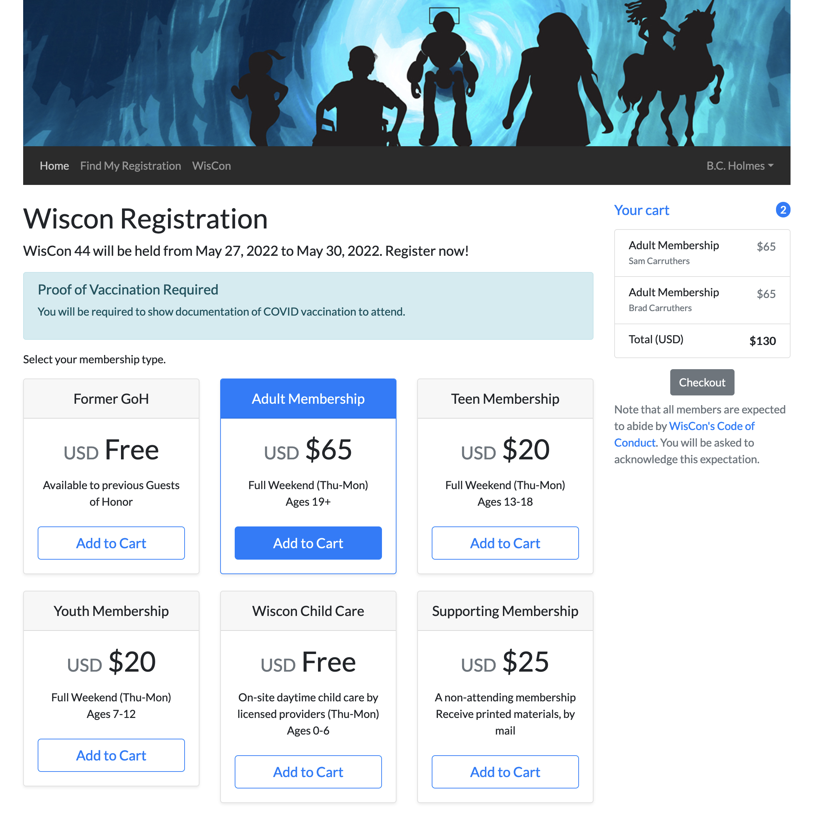
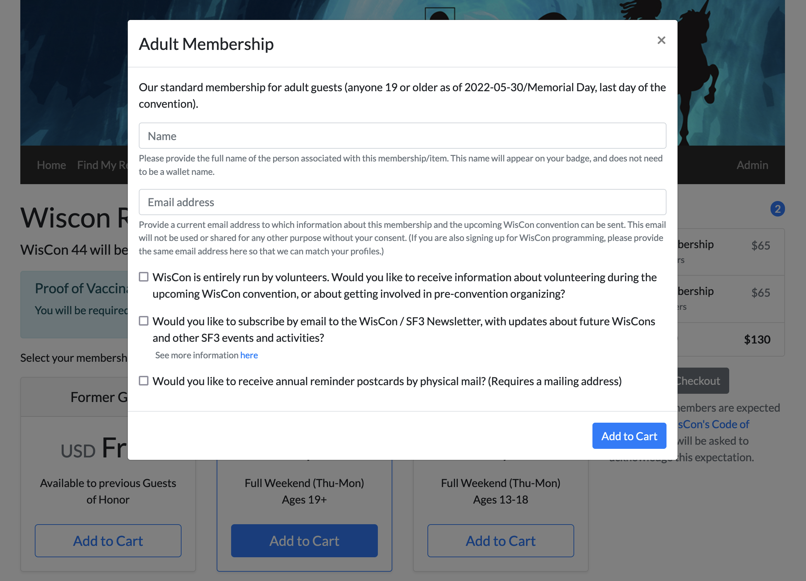

# WisCon Online Registration - Client Component

The Online Registration application client component is created as a React app using React-Bootstrap. 

## Getting Started

1. Clone the repo from GitHub
2. `cd client`
3. `npm install`
4. `npm run start`

## Screenshots

Here are some screenshots of the application.

